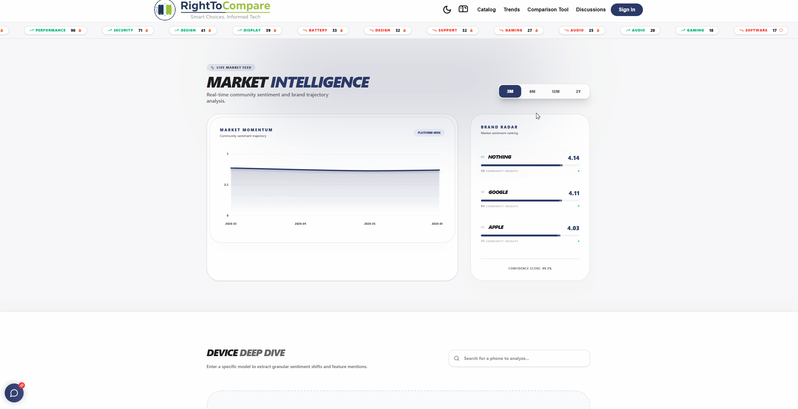
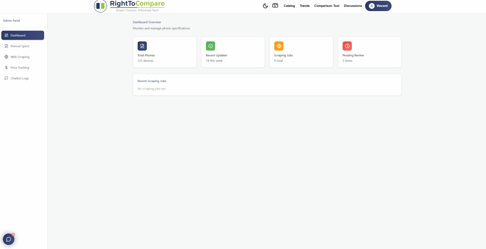

# RightToCompare | Mobile Device Analytics & Comparison Platform

A full-stack mobile hardware comparison platform designed to help users make data-driven purchasing decisions. RightToCompare bridges the gap between raw hardware specifications and user sentiment through interactive comparison grids, real-time market dashboards, and an AI-powered recommendation engine.

---

## Technical Architecture & Design Philosophy

RightToCompare is built on a decoupled **TypeScript-MERN** stack. The backend is organized using a clean **Router-Controller-Service** architecture, which strictly separates API routing from core business logic.

Rather than serving static pages, the platform operates as a highly dynamic application capable of handling heavy background tasks. The architecture was designed specifically to support continuous data aggregation (via web scrapers), real-time user interface updates, and strictly enforced Role-Based Access Control (RBAC) to separate public features from administrative operations.

---

## High-Value Feature Showcases

To experience the platform's advanced capabilities without running the entire stack locally, review the interactive technical demonstrations below:

<details>
  <summary><b>1. Side-by-Side Comparison Grid & Row Filtering (Demo)</b></summary>
  <br/>
  <p align="center">
    
  </p>
  <p>A high-performance alignment layout that uses client-side state manipulation to render multi-dimensional device parameters side-by-side. Includes responsive row-hiding controls to dynamically filter out unneeded specifications, optimizing viewport scannability for extensive hardware datasets.</p>
</details>

<details>
  <summary><b>2. Conversational AI Device Recommendation Engine (Demo)</b></summary>
  <br/>
  <p align="center">
    
  </p>
  <p>An intelligent, natural language processing pipeline that bridges user-space prompts with backend machine learning evaluation loops. Users can input fluid contextual requirements (e.g., <i>"Find a phone under $700 with a top-tier camera and all-day battery life"</i>), and the engine parses the technical criteria to dynamically return a ranked, granularly matched inventory grid.</p>
</details>

<details>
  <summary><b>3. Market Intelligence & Sentiment Trend Dashboard (Demo)</b></summary>
  <br/>
  <p align="center">
    
  </p>
  <p>An advanced analytics suite utilizing interactive data visualization layouts to monitor macro-level market shifts and brand reputation based on aggregated user review metrics.</p>

  <h4>Core Dashboard Capabilities:</h4>
  <ul>
    <li><b>Market Trend Visualization:</b> Tracks upward and downward momentum across the broader mobile sector by charting historical sentiment trajectories.</li>
    <li><b>Granular & Macro Graphing:</b> Dynamically renders isolated sentiment graphs for individual device models alongside aggregated, top-level brand reputation scores.</li>
    <li><b>Live Trending Ticker:</b> A real-time rolling data ticker that identifies and broadcasts the most polarized hardware topics (highest positive/negative density) over a trailing 30-day window.</li>
  </ul>
</details>

<details>
  <summary><b>4. Keyword-Based Sentiment Analyzer & Review Aggregator (Demo)</b></summary>
  <br/>
  <p align="center">
    
  </p>
  <p>A deterministic text-parsing infrastructure designed to audit community reviews and forum posts in real time.</p>

  <h4>Key Engineering Mechanics:</h4>
  <ul>
    <li><b>Algorithmic Keyword Matching:</b> Scans incoming text payloads against an optimized dictionary of descriptive sentiment benchmarks to classify mentions as explicitly positive or negative.</li>
    <li><b>Dynamic Post Tagging:</b> Generates and appends visual sentiment indicators directly onto individual community posts upon database ingestion.</li>
    <li><b>Data Aggregation Layer:</b> Mathematically compiles individual keyword markers into a centralized, live "Pros & Cons" summary grid across all community content on the device page.</li>
  </ul>
</details>

<details>
  <summary><b>5. Real-Time Community Discussion & Forum (Demo)</b></summary>
  <br/>
  <p align="center">
    
  </p>
  <p>A dynamic, threaded community discussion interface engineered for seamless user interaction and instantaneous UI state synchronization.</p>

  <h4>Core Engineering Mechanics:</h4>
  <ul>
    <li><b>Threaded State Management:</b> Manages complex, nested data structures on the client side, allowing users to engage in multi-tiered conversations without performance degradation.</li>
    <li><b>Optimistic UI Rendering:</b> Ensures instantaneous client-side updates upon payload submission, providing a fluid, app-like responsiveness before awaiting backend database confirmation.</li>
    <li><b>Contextual Data Association:</b> Ties user-generated content schemas directly to specific device IDs, building hyper-relevant, localized knowledge bases for every hardware entry in the catalog.</li>
  </ul>
</details>

<details>
  <summary><b>6. Administrative Control Console (Demo)</b></summary>
  <br/>
  <p align="center">
    
  </p>
  <p>A secure administrative console restricted behind server-side authorization check gates to orchestrate platform data lifecycles:</p>

  <ul>
    <li><b>Pipeline Triggers:</b> Manual override interface to instantly initialize background web-scraping scripts, pulling and normalizing fresh device data streams into the live database.</li>
    <li><b>System Auditing:</b> Secure, centralized tracking of conversational AI transaction histories and user chatlogs for runtime performance evaluation and debugging.</li>
    <li><b>Data Mutation Isolation:</b> Restricts critical CRUD operations (Create, Read, Update, Delete) exclusively to authenticated administrator accounts, blocking unauthorized access to master MongoDB schemas.</li>
  </ul>
</details>

---

## Complete Technical Competency Grid

- **Frontend Engine & UI:** React (v18), TypeScript, TailwindCSS, State Management Toggles, LocalStorage Tracking, Figma.
- **Backend Architecture:** Node.js, Express.js, TypeScript, Router-Controller-Service Pattern, JWT Session Management & Token Rotation.
- **Data Management & Gathering:** MongoDB (Mongoose ODM), Puppeteer / Scraping Infrastructure, External API Integrations (GeekBench).
- **Security Implementation:** Input Ingestion Sanitization, Server-Side Authorization Gates, HTTP Rate Limiting, Environment Variable Isolation.

---

## Local Deployment Blueprint

### Prerequisites

- Node.js (v18.x or higher)
- Active MongoDB Instance (Local Daemon or Atlas Configuration)

### 1. Repository Setup

```bash
git clone [https://github.com/drnpf/righttocompare.git](https://github.com/drnpf/righttocompare.git)
cd righttocompare
```

### 2. Environment Variables Configuration

Establish a comprehensive `.env` cluster inside your root backend directory structure. Do not commit your active API keys to version control:

```env
# Server Configuration
PORT=5001

# MongoDB Pipeline Connections
MONGO_URI=your_cluster_connection_string
DB_NAME=test
PHONE_COLLECTION=phones
SCRAPE_COLLECTION=scrape_output

# AI Recommendation Engine (ChatBot)
MAX_CANDIDATES=200

# Security & Authorization Gates
FIREBASE_WEB_API_KEY=your_firebase_client_key
INTERNAL_BYPASS_KEY=your_administrative_override_secret
```

---

### 3. Dependency Aggregation & Service Execution

Because this application utilizes a fully decoupled architecture, the client and server environments must be initialized in separate terminal instances.

**Terminal 1: Backend Initialization**

```bash
# Navigate to the server directory
cd backend

# Ingest backend dependencies
npm install

# Initialize the Express server (Listens on Port 5001)
npm run dev

# If you are on LINUX use:
npm run dev:linux
```

**Terminal 2: Frontend Initialization**

```bash
# Navigate to the client directory
cd frontend

# Ingest frontend UI dependencies
npm install

# Initialize the React runtime environment (Starts on Port 3000)
npm run dev
```

---

## The Engineering Team

RightToCompare was designed and developed as a collaborative Computer Science Senior Capstone Project (Class of 2026) by:

- **Darren** – [GitHub](https://github.com/drnpf)
- **Michael** – [GitHub](https://github.com/m-the-coder)
- **Dean** – [GitHub](https://github.com/DSC010)
- **Simon** – [GitHub](https://github.com/Simonv84)
- **Vincent** – [GitHub](https://github.com/vincenttchi)

_A special thanks to our advisors and peers at California State University, Long Beach for their guidance and feedback throughout the software development lifecycle._
